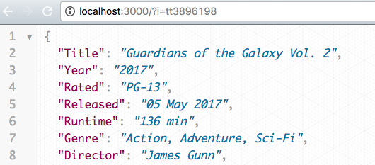

# Movie Finder Data
> Uses the Express framework to build a server that can talk to another server and cache the results.

This was my sixth project at Origin Code Academy. This server was created using NodeJS and Express. To log all incoming requests I used the morgan logging library. I made requests using the axios library.



## Approach

This app demonstrates running a server that can talk to another server using NodeJS with the Express framework. The middleware used for this app was [morgan](https://github.com/expressjs/morgan) and [axios](https://www.npmjs.com/package/axios). Morgan is an HTTP request logger middleware for Node.js. Axios is a promise based HTTP client for browser and Node.js.

## Installation

Download all associated files and load them up in your favorite text editor!

## Development setup

This app relies on NodeJS, Express, morgan, and axios for its functionality. 

I recommend using [nodemon](https://www.npmjs.com/package/nodemon) to run this server.

```sh
npm install -g nodemon
// cd to-your-web-folder
nodemon server
```

## Contact Information

Twitter: [@adriftinthesea](https://twitter.com/adriftinthesea)

Email: z@zamarise.com

GitHub: [https://github.com/zamarise](https://github.com/zamarise/)
